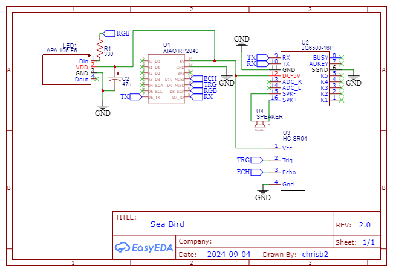

# Seabird Electronic Sculpture

A tribute to the amazing interactive sculptures of the [The Lost Gypsy](https://thelostgypsy.com/) in  [Papatowai, New Zealand](https://www.google.com/maps/place/?q=place_id:ChIJwapUtKWmLagRdHW5ZbnSops).

## Parts

* Paua shell
* Seeed Studio [XIAO RP2040](https://www.seeedstudio.com/XIAO-RP2040-v1-0-p-5026.html) or other Micropython compatible MCU
* JQ6500 MP3 Player
* HC-SR04 ultrasonic sensor
* Ultrathin speaker 8Ohms, 1W, 20mm diameter
* 3mm LEDS, various colours

## Circuit

## Programming

Load the MP3 files to the JQ6500 as described in [https://sparks.gogo.co.nz/jq6500/index.html](https://sparks.gogo.co.nz/jq6500/index.html). Use [Thonny](https://thonny.org/) to load all the python files to the RP2040.
